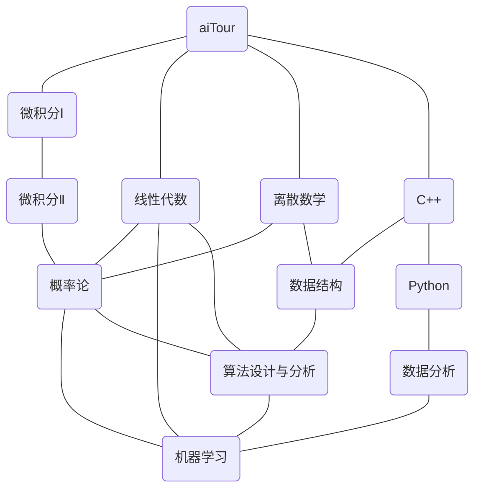

# My aiTour

截至目前，这是我个人的 AI 学习路线（顺序为由上到下，连线为对应的先修关系）：

这份学习路线仅仅只是一个抛砖引玉——每个人都应该有自己独特的学习路线，而不是一味地照搬别人的。这里提供一个思路，以构建你自己的学习路线：

!!! note "aiTour生成算法"
    1. 前往斯坦福大学的官网，搜索人工智能相关课程，这里以吴恩达教授的 [CS229](https://cs229.stanford.edu/) 为例；
    2. 进入对应课程的网址，查看课程介绍中的 [Prerequisites](https://docs.google.com/document/d/1P2s6xxcAT9VRwnEHApB3NHnIpcR8WWvyswHh3xDH_0E/edit#heading=h.u0en5qo62ffo)，就能得知修该门课所需要的先修课程（这里为 CS106A or CS106B, CS106X; CS 109, MATH151, or STATS 116; Math 51），并记录得到的先修关系；
    3. 对查询到的所有先修课程反复进行第2步，除非某个课程没有先修课程。

通过上述过程，就可以构建起一个斯坦福版本的学习路线了。（当然，不一定必须学习相应的斯坦福课程，完全可以在网上查找推荐的替代课程）

或者，你也可以参考 [UCB](https://hkn.eecs.berkeley.edu/courseguides) 的课程地图。再或者，你也可以将上述思路运用到 [csdiy](https://csdiy.wiki) 中。

在确定好学习路线后，就需要确定学习每门课程所用的资料了。这个步骤就需要按照你的个人喜好来决定。一般来说，所需的资料在网上应该是数不胜数的，你可以按需挑选最符合你胃口的资料和课程。

在做好这些准备工作后，请开始你的 AI 学习之旅吧！
