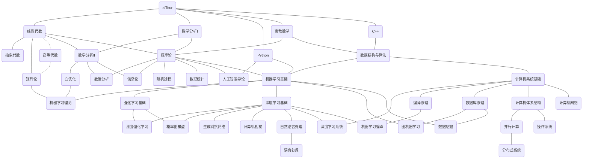

# Future Plans

> 本界面记录本书的未来计划，包括了一个完整的学习路线规划。

## 一个完整的学习路线

这份路线使用 [mermaid](https://mermaid.js.org/) 写下。使用前，请仔细判断先修关系是否正确。（注：为了美观，去除了一些先修关系的连线）

另外，下面的课程，由于我本人可能并不会修读，所以也没有办法在书中列出，故列在这里希望能有人帮助共同完善。如果你有意向帮助完善本书，我将不胜感激！

- [ ] 人工智能导论
- [ ] 数据科学
- [ ] 计算复杂性
- [ ] 抽象代数
- [ ] 机器学习编译
- [ ] 人工智能硬件/系统
- [ ] 人工智能安全以及密码学相关
- [ ] 偏微分方程
- [ ] 测度论
- [ ] 实分析
- [ ] 泛函分析
